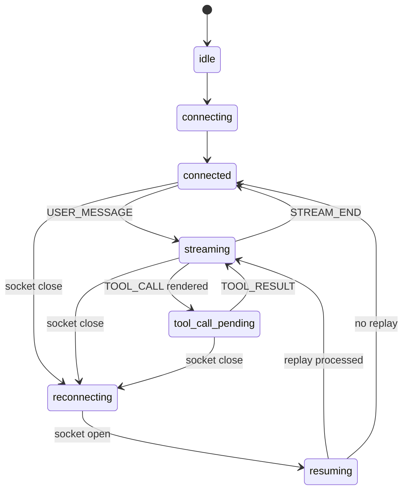

# Decisions

## Architecture Summary

This project is a Next.js App Router client for the provided `agent-server`.
The backend is treated as fixed infrastructure; all protocol correctness lives in the frontend.

The app is being built as an observability console rather than a decorative chat UI. The first screen will be the working console: streaming chat, trace timeline, context inspector, protocol health, flight recorder, chaos checklist, and submission readiness.

## WebSocket State Machine

## Running Commit Log

### 1. chore: scaffold strict Next app

Added the minimal Next.js, TypeScript, Vitest, and CSS foundation. The main tradeoff is starting with a plain shell instead of a generated UI kit so the final interface can stay compact and purpose-built for this protocol exercise.

### 2. chore: install audited dependencies

Installed the frontend dependency tree and kept the audit clean at the moderate threshold. The app uses current Next/Vitest packages with explicit transitive overrides where needed so the submission does not start with known package warnings.

### 3. style: establish control-room visual system

Set the UI direction before wiring behavior: matte workspace, dark command bar, compact metric tiles, and fixed panel boundaries. This keeps later protocol work honest because streamed content has to fit into stable regions instead of stretching the whole page.

### 4. feat(protocol): define websocket message contracts

Added local protocol types that mirror the backend contract instead of importing from `agent-server`. Keeping the boundary explicit makes it easier to explain what the client trusts and what it validates.

## Ordering And Deduping Rationale

To be completed when the ordered event processor lands.

## Tool ACK Rendering Rationale

To be completed when rendered tool acknowledgements land.

## Reconnection Recovery Rationale

To be completed when reconnect/resume lands.

## UI And Layout Stability Rationale

The UI favors fixed panel boundaries, stable stream segments, and bounded scroll regions so protocol events do not resize the application under stress. Color is reserved for state: green for healthy, amber for waiting or reconnecting, red for violations, and blue for active selection.

## Known Backend Limitation

The server replays already-sent history after `RESUME`. Its source notes that a dropped in-progress script is not actually resumed, so the client must preserve state honestly and document what was recovered.

## Scaling Notes

To be completed in the final documentation pass.
