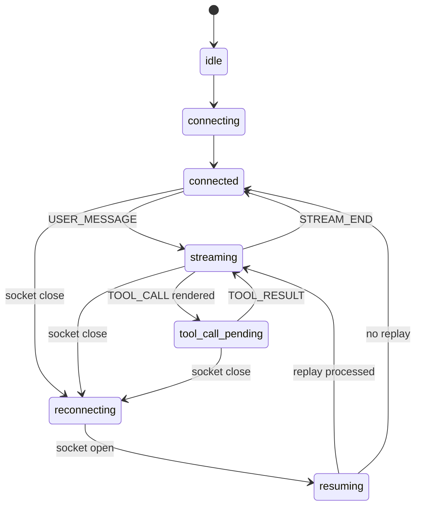

# Decisions

## Architecture Summary

This project is a Next.js App Router client for the provided `agent-server`.
The backend is treated as fixed infrastructure; all protocol correctness lives in the frontend.

The app is being built as an observability console rather than a decorative chat UI. The first screen will be the working console: streaming chat, trace timeline, context inspector, protocol health, flight recorder, chaos checklist, and submission readiness.

## WebSocket State Machine

## Running Commit Log

### 1. chore: scaffold strict Next app

Added the minimal Next.js, TypeScript, Vitest, and CSS foundation. The main tradeoff is starting with a plain shell instead of a generated UI kit so the final interface can stay compact and purpose-built for this protocol exercise.

### 2. chore: install audited dependencies

Installed the frontend dependency tree and kept the audit clean at the moderate threshold. The app uses current Next/Vitest packages with explicit transitive overrides where needed so the submission does not start with known package warnings.

### 3. style: establish control-room visual system

Set the UI direction before wiring behavior: matte workspace, dark command bar, compact metric tiles, and fixed panel boundaries. This keeps later protocol work honest because streamed content has to fit into stable regions instead of stretching the whole page.

### 4. feat(protocol): define websocket message contracts

Added local protocol types that mirror the backend contract instead of importing from `agent-server`. Keeping the boundary explicit makes it easier to explain what the client trusts and what it validates.

### 5. feat(protocol): validate websocket frames

Added runtime parsing from raw strings to typed server messages. The important decision is that JSON parsing returns `unknown`; protocol guards do the narrowing so malformed frames become traceable system events instead of crashing the UI.

### 6. feat(protocol): add ordered event processor

Added the ordered processor around a `Map` buffer and a processed sequence set. A `Map` keeps out-of-order messages addressable by `seq`, while the set makes duplicate handling cheap and explicit.

### 7. test(protocol): cover seq ordering edge cases

Added focused tests for the ordering buffer before connecting it to React. The tests intentionally describe DOM-consumption semantics: a future message may be received, but it does not advance `lastProcessedSeq`.

### 8. feat(state): model console state machine

Added the central reducer for turns, stream segments, protocol metrics, flight events, context histories, checklist state, and submission logs. This is deliberately separate from React rendering so protocol behavior can be tested without a browser.

### 9. test(state): cover stream and tool transitions

Added tests for text/tool/text segmentation, immediate tool calls, and stream-end integrity. These tests protect the core UX promise: tool interruptions create stable cards instead of rewriting a single mutable paragraph.

### 10. feat(socket): connect to agent server

Added the first WebSocket controller and wired the shell to live state. This commit does not try to solve recovery yet; it only opens the socket, parses frames, feeds ordered messages into the reducer, and sends `USER_MESSAGE` payloads.

### 11. feat(socket): handle ping pong immediately

Heartbeat replies now happen right after a frame parses, before ordered rendering waits for missing sequence numbers. That matters in chaos mode because a `PING` can arrive while earlier messages are still buffered.

### 12. feat(socket): add reconnect and resume

Added capped exponential reconnect attempts and send `RESUME` immediately when a replacement socket opens. The client does not clear chat state on close; reconnect is treated as a transport repair, not a new conversation.

### 13. feat(socket): separate received and committed seq

Moved resume tracking to a committed sequence ref that is updated after React accepts state. This keeps `RESUME` tied to what the UI has consumed, not just what the socket callback happened to receive.

### 14. feat(socket): acknowledge rendered tools

Added one-shot `TOOL_ACK` sending from an effect that runs after tool cards are present in state. This makes the acknowledgement closer to rendered reality than sending inside the WebSocket message callback.

### 15. feat(chat): render stable streaming segments

Replaced the segment counter with actual text, tool, error, and stream-end segment rendering. Each interruption creates a new segment rather than rewriting one large answer string, which is the basis for avoiding flicker and duplicate text.

### 16. feat(chat): polish tool call cards

Expanded tool cards with call IDs, argument/result sections, seq metadata, and ACK state. The card is now useful during debugging instead of being only a visual interruption marker.

### 17. feat(chat): add stream integrity badges

Added compact per-stream integrity badges below the rendered answer. They expose the details evaluators care about: token count, sequence range, reconnect count, duplicate handling, and whether `STREAM_END` arrived.

### 18. feat(trace): add flight recorder events

Turned the raw event list into a small flight recorder with timestamps, direction labels, and payload previews. The goal is to make protocol behavior inspectable without opening DevTools.

### 19. feat(trace): group token timeline rows

Added a derived trace-row model that groups consecutive token events by stream. This prevents token floods from drowning out higher-signal events like tool calls, context snapshots, client replies, and reconnects.

### 20. feat(trace): link trace and chat selections

Added IDs that connect trace rows back to chat segments and tool cards. The link is bidirectional so the timeline can be used as a debugger, not just a passive log.

### 21. perf(trace): virtualize trace timeline

Added a small local virtual list instead of pulling in a large UI dependency. The timeline now renders a bounded window of rows while still auto-following live events.

## Ordering And Deduping Rationale

Server events are processed only when their `seq` matches the expected next value. Future events wait in a `Map<number, ServerMessage>`, already-processed or already-buffered sequence numbers are ignored, and a new user message resets the processor because the backend resets `seq` and history for each turn.

## Tool ACK Rendering Rationale

The client sends `TOOL_ACK` once the reducer has created the tool segment and React has had a chance to commit the state. ACK IDs are tracked in a set so duplicate `TOOL_CALL` frames or replayed events do not create duplicate acknowledgements.

## Reconnection Recovery Rationale

Reconnect uses a capped backoff of 500ms through 10s. On open, the first protocol message is `RESUME` with the latest committed sequence number the UI knows about, so the server can replay anything after that point. Socket receipt, ordered processing, and committed UI state are treated as separate moments.

## UI And Layout Stability Rationale

The UI favors fixed panel boundaries, stable stream segments, and bounded scroll regions so protocol events do not resize the application under stress. Color is reserved for state: green for healthy, amber for waiting or reconnecting, red for violations, and blue for active selection.

## Known Backend Limitation

The server replays already-sent history after `RESUME`. Its source notes that a dropped in-progress script is not actually resumed, so the client must preserve state honestly and document what was recovered.

## Scaling Notes

To be completed in the final documentation pass.
