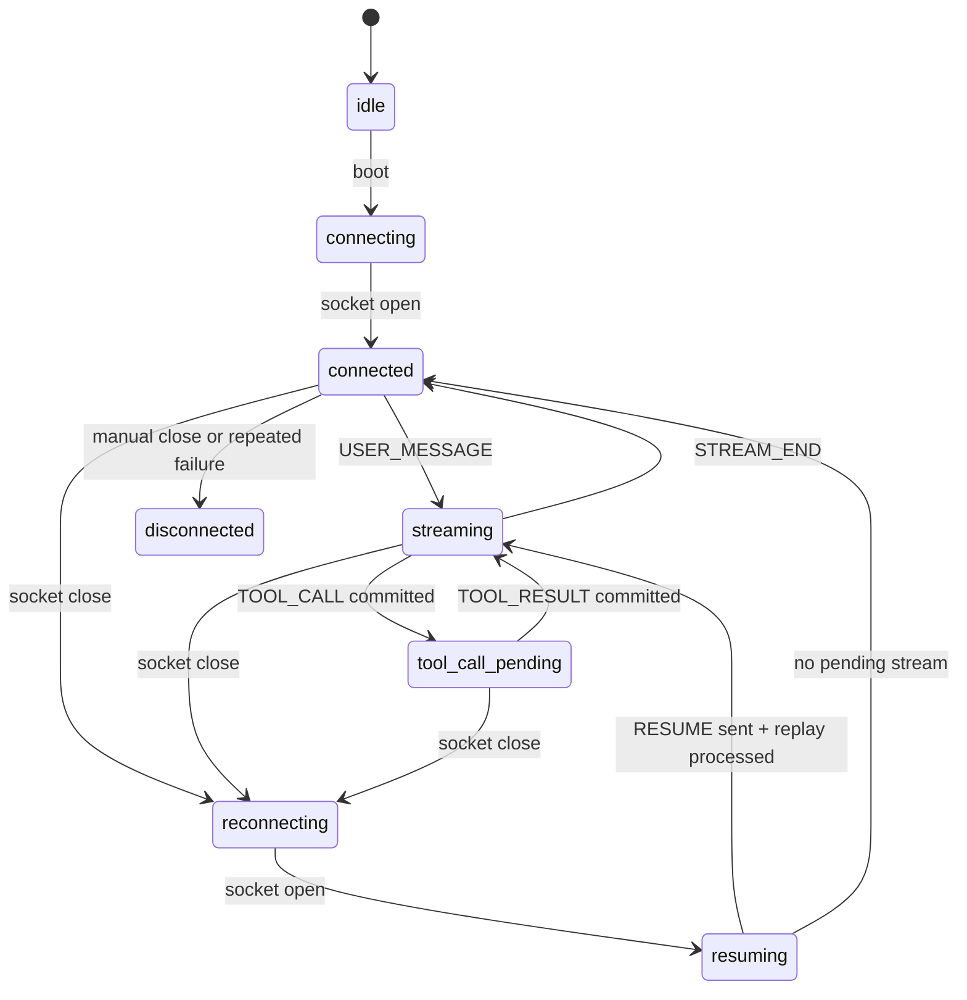

# Alchemyst Agent Observability Console

This submission builds the required Agent Console as a real-time systems UI instead of a generic chat surface. The client treats the WebSocket protocol as the source of truth: events are parsed from `unknown`, processed in `seq` order, deduped, committed to reducer state, and then reflected in a dense observability workspace with chat, trace, context, replay, chaos, and readiness panels.

The standout layer is intentionally practical: a protocol health bar, flight recorder, replay scrubber, chaos demo checklist, integrity badges, and `/log` readiness panel make correctness visible while the backend is streaming, dropping sockets, replaying events, or sending oversized context.

## Run It

Start the provided backend first. The app expects the backend on `localhost:4747`.

```bash
cd June-2026_FullStackAI/agent-server
docker build -t agent-server .
docker run -p 4747:4747 agent-server
```

For chaos mode:

```bash
cd June-2026_FullStackAI/agent-server
docker run -p 4747:4747 agent-server --mode chaos
```

Run the frontend in another terminal:

```bash
cd June-2026_FullStackAI
npm install
npm run dev
```

Open `http://localhost:3000`. The client connects to `ws://localhost:4747/ws` and reads submission evidence from `http://localhost:4747/log`.

## Verification

```bash
npm run test
npm run build
npm audit --audit-level=moderate
```

Local verification from this workspace:

| Check | Result |
|---|---|
| `npm.cmd test` | 3 files, 12 tests passing |
| `npm.cmd run build` | Next production build passing |
| `npm.cmd audit --audit-level=moderate` | 0 vulnerabilities |

Vitest may need to run outside a restricted filesystem sandbox because esbuild reads the Vitest config through Node resolution.

## WebSocket State Machine



Key protocol decisions:

- `PING` is answered immediately, before ordered rendering waits for missing sequence numbers.
- `RESUME` is the first client message after reconnect and uses the last committed `seq`, not merely the last received frame.
- `TOOL_ACK` is sent after the reducer has materialized the tool card, with one-shot dedupe per `call_id`.
- Out-of-order server frames wait in a `Map<number, ServerMessage>` until the next expected `seq` arrives.
- Duplicate `seq` values are ignored before they can mutate UI state.

## Console Features

The first screen is the console itself:

- Streaming chat with stable text segments, stacked tool cards, tool result updates, and per-stream integrity badges.
- Virtualized trace timeline with grouped token rows, client/server/system events, filters, search, and chat linking.
- Virtualized context inspector with lazy JSON expansion, worker-backed diffs, path highlights, and snapshot scrubber.
- Protocol health bar for connection state, last/next sequence, buffer pressure, duplicates, gaps, reconnects, ACK latency, and PONG latency.
- Agent flight recorder with replay mode so a run can be scrubbed after it completes.
- Chaos demo checklist with timestamps and JSON summary export.
- Submission readiness panel that fetches `/log` and summarizes observed `PONG`, `TOOL_ACK`, `RESUME`, and violations.

## Demo Prompts

Use these prompts to cover the backend scripts:

```text
hello
summarize the Q3 report
analyze the correlation
find the SLA docs
show me the full database schema
write a long detailed document
```

## Chaos Recording Checklist

Record 3-5 minutes in chaos mode with the built-in checklist visible. The expected clips are:

1. Connection drop mid-stream, with the reconnect indicator appearing quickly.
2. Out-of-order or duplicate frames, with no duplicated rendered text.
3. Rapid tool calls, with multiple cards stacked and results matched by `call_id`.
4. Oversized context snapshot, with chat still usable while the inspector remains interactive.
5. Corrupt heartbeat, including empty `challenge`, with `PONG` accepted by the backend log.

After the run, press the console's `/log` fetch button and export the chaos summary JSON.

## Screenshot Slots

Add final screenshots before sending the submission:

| Slot | Suggested file | What it should show |
|---|---|---|
| Stream + tool | `docs/screenshots/01-stream-tool.png` | Incremental answer, frozen text, rendered tool card, integrity badges |
| Trace timeline | `docs/screenshots/02-trace-timeline.png` | Grouped token row, linked tool call/result rows, filters |
| Context diff | `docs/screenshots/03-context-diff.png` | JSON tree, highlighted diff paths, snapshot scrubber |
| Chaos evidence | `docs/screenshots/04-chaos-health.png` | Health bar, checklist timestamps, readiness panel |

## Project Layout

```text
src/app/                 Next App Router entry and global CSS
src/components/          Console panels, virtual list, JSON tree
src/core/protocol/       Message contracts, parser, ordered processor
src/core/console-state.ts Reducer and UI state machine
src/core/json-diff.ts    Nested JSON diff engine
src/core/replay.ts       Flight-recorder replay reconstruction
src/hooks/               WebSocket controller and side effects
src/workers/             Context diff worker
```

## Backend Scope

`agent-server` is unchanged. The frontend documents one known backend limitation honestly: `RESUME` replays already-sent history, but a dropped in-progress generation may not truly continue after certain chaos disconnects. The UI preserves committed state, dedupes replay, and makes that recovery behavior visible.
